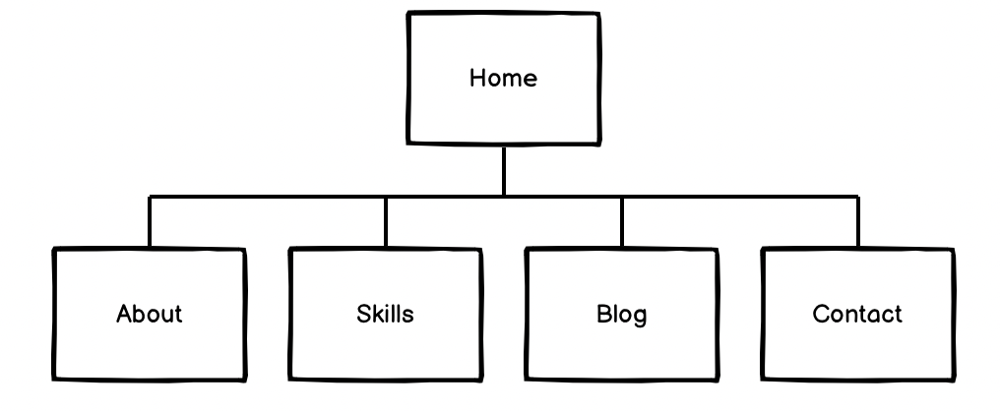

# mattty-t.github.io
**Website:** mattty-t.github.io

**Github:** https://github.com/mattty-t

**Purpose**

The purpose of this website is to showcase the skills that I have learned so far during my time at CoderAcademy. By utilising the knowledge I have learned to design a website using HTML and CSS. This site will also evolve over time as my skills improve. It is to showcase my current and future projects and acts as a online resume for future employers. I have kept this site minimalistic, simple and vibrant. It shows the design and style I would like to pursue.

**Functionality / features**

<li> Hamburger navigation bar - Whenever the screen on mobile devices goes below 400px; a hamburger navigation bar will be displayed. Clicking the toggle button will create a list that will drop down and allow the users to navigate the website. The toggle button was used with the help of Javascript. 
<li> Hover effect and transition effect - Hovering over the navigation bar will allow users to know which page they want to visit. It is very visual and will allow easier. 
<li> Form function - The form function will allow potential employers and customers to connect with me. 

**Sitemap**

Screenshots

**Target audience**

The target audience for my website is for potential employers who are looking for developers. 

**Tech stack (e.g. html, css, deployment platform, etc)**
I used html to design my website and then used a css stylesheet to add effects and style my website portfolio. I used Javascript to create a toggle feature for my hamburger navigation bar. I used github to deploy my website. 