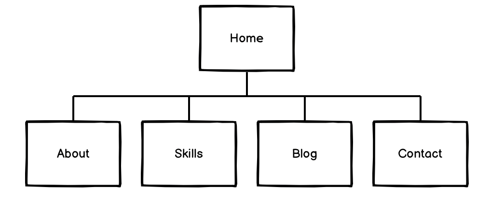

# mattty-t.github.io
**Website:** mattty-t.github.io

**Github:** (https://github.com/mattty-t)

**Purpose**

The purpose of this website is to showcase the skills that I have learned so far during my time at CoderAcademy. By utilising the knowledge I have learned to design a website using HTML and CSS. This site will also evolve over time as my skills improve. It is to showcase my current and future projects and acts as a online resume for future employers. I have kept this site minimalistic, simple and vibrant. It shows the design and style I would like to pursue.

**Functionality / features**

<ul>
<li> Hamburger navigation bar- Whenever the screen on mobile devices goes below 400px; a hamburger navigation bar will be displayed. Clicking the toggle button will create a list that will drop down and allow the users to navigate the website. The toggle button was made using Javascript.</li>
<li> Hover effect and transition effect - Hovering over the sections on the navigation bar will allow users to know which page they want to visit. It is very visual and will allow easier.</li>
<li> Form function - The form function will allow potential employers and customers to connect with me.</li> 
</ul>

**Sitemap**

The sitemap of the website is basic. The sitemap will have a total of four pages that are linked to the Home Page. The Home Page can be accessed through any of the pages and also each page can also access each other pages as seen by the sitemap. 

**Screenshots**

Below will show the screenshots of my website.

**Target audience**

The target audience for my website is for potential employers who are looking for front-end/full stack-developers.

**Tech stack (e.g. html, css, deployment platform, etc)**

I used Visual Studio Code to code my website. I mainly used Front-end tech stack of:  
<uL>
<li> <b>HTML</b> - used to to design my website and pages (home, about, skills, blog and contact). Using semantic tags such as header, section, main, footer for most of my pages. I used article for my blog page. </li>
<li> <b>CSS</b> - used to format and style the layout of my website and also adjust the font size and style, color, of my webpages. </li> 
 

I used other tech stack listed below to help assist with my website:
<li> <b>JavaScript</b> - Used to code a toggle button feature for my hamburger navigation bar when the screen goes below 400px for mobile.
</li>
<li> <b>GitHub</b> - Used to create a GitHub repository on my GitHub account which will allow me to edit and push my changes to it. It also allowed me to deploy my site from a static website to a dynamic website.
</li>
<li> <b>Trello</b> - Used to help me keep me accountable for </li>
<li> <b>Font-Awesome</b> - I used their icons on the website to make my website more visually appealing for my social-icons and also for my skills page</li>
</ul>
